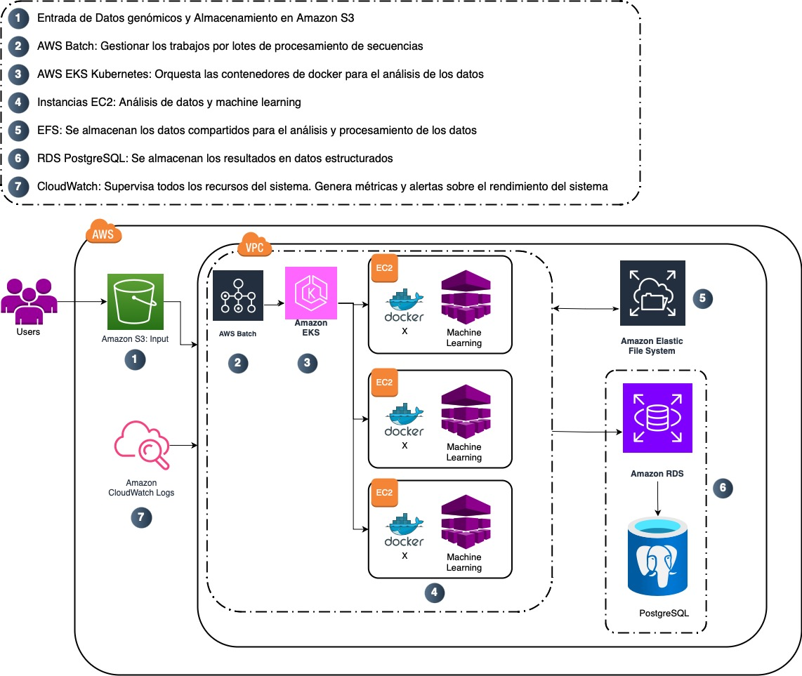

# Proyecto de Análisis Genómico: Biotech Explorer Corp

## Diagrama de arquitectura

## Descripción de la arquitectura
Esta arquitectura en AWS está diseñada para el análisis de datos genómicos. Utiliza una combinación de servicios como Amazon EC2, Amazon S3, AWS Batch, Amazon RDS, EKS, EFS.

La arquitectura implementa un flujo de procesamiento de datos que comienza con la recolección periódica de datos genómicos de una API externa y finaliza con la generación de predicciones de modelos entrenados. Se usa Amazon EC2 para la extracción de datos, S3 para almacenamiento, AWS Batch para gestión de trabajos por lotes, y una combinación de EC2, Docker, y EKS para procesamiento intensivo de nuevos datos, predicciones y orquestación de contenedores. Los resultados son almacenados en Amazon RDS.

## Componentes Principales

### 1. API de Tercero - Recogida de datos genómicos
Los datos genómicos crudos provienen de una API de terceros que proporciona las secuencias genómicas. Esta API externa es consumida por el sistema para recoger los datos que luego serán utilizados para entrenar los modelos de machine learning.

### 2. Amazon EC2 - Llamada periódica al API
Una instancia de Amazon EC2 ejecuta un cron job que periódicamente accede a la API de terceros para descargar los datos genómicos. El script en EC2 gestiona la autenticación, realiza la llamada y maneja la recepción de los datos.

### 3. Amazon S3 - Almacenamiento de datos crudos
Los datos obtenidos por la instancia EC2 son almacenados en Amazon S3 en formato crudo. S3 es el repositorio de almacenamiento principal para los datos genómicos antes de ser procesados.

### 4. AWS Batch - Gestión de trabajos por lotes
AWS Batch gestiona la ejecución de trabajos por lotes, asegurando que las instancias de EC2 se lancen de manera eficiente para procesar las secuencias genómicas.

### 5. Amazon EC2 con Docker - Procesamiento y entrenamiento del modelo
Las instancias de Amazon EC2 corren contenedores Docker que ejecutan los algoritmos de análisis y machine learning. Estos contenedores entrenan modelos genómicos basados en los datos almacenados en S3

### 6. Amazon Elastic File System (EFS) - Almacenamiento compartido
Amazon EFS proporciona un sistema de archivos compartido entre las instancias EC2 que están procesando los datos y entrenando los modelos.

### 7. Amazon RDS con PostgreSQL - Almacenamiento de resultados
Amazon RDS almacena los resultados de los análisis genómicos en una base de datos relacional utilizando PostgreSQL. Los metadatos estructurados y resultados finales se almacenan aquí para acceso futuro.

### 8. Usuarios - Acceso a resultados y predicciones en tiempo real
Los usuarios finales pueden acceder a los resultados de las predicciones ingresando nuevos datos al modelo para su predicción.

### 9. Amazon EKS - Orquestación de contenedores para predicciones del modelo
Amazon EKS (Elastic Kubernetes Service) se utiliza para orquestar contenedores Docker que ejecutan los modelos entrenados para realizar predicciones en tiempo real.

### 10. Amazon EC2 - Ejecución de predicciones
Las instancias de Amazon EC2 procesan las solicitudes de predicción utilizando los modelos entrenados, generando resultados de predicción para nuevos datos.

### 11. Amazon CloudWatch - Supervisión y Monitoreo
CloudWatch supervisa el rendimiento de la infraestructura, emitiendo alertas y generando métricas sobre el uso de recursos como EC2, S3, y RDS.
