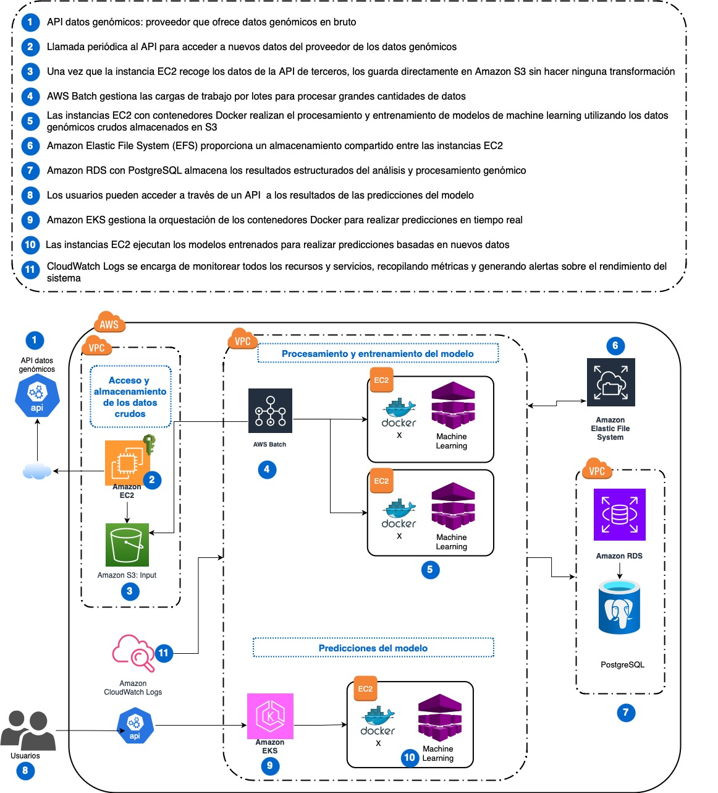

# Proyecto de Análisis Genómico: Biotech Explorer Corp

## Diagrama de arquitectura

## Descripción de la arquitectura
Esta arquitectura en AWS está diseñada para el análisis de datos genómicos. Utiliza una combinación de servicios como Amazon EC2, Amazon S3, AWS Batch, Amazon RDS, EFS.

Los datos genómicos se almacenan en S3 y se procesan utilizando contenedores de Docker gestionados por Amazon EKS en instancias de EC2, mientras que AWS Batch se encarga de gestionar las cargas de trabajo por lotes.

## Componentes Principales

### 1. Amazon S3 - Entrada de Datos Genómicos
Los usuarios suben los datos genómicos en bruto (archivos en formatos como FASTQ o BAM) al bucket de Amazon S3.
Estos datos son almacenados y preparados para ser procesados en las siguientes etapas de la arquitectura.

### 2. AWS Batch - Gestión de Trabajos por Lotes
AWS Batch gestiona la ejecución de trabajos por lotes, asegurando que las instancias de EC2 se lancen de manera eficiente para procesar las secuencias genómicas.

### 3. Amazon EKS - Orquestación de Contenedores
Amazon EKS (Elastic Kubernetes Service) se utiliza para orquestar los contenedores Docker que ejecutan los algoritmos de análisis genómico.

### 4. Amazon EC2 - Procesamiento Intensivo
Las instancias Amazon EC2 son utilizadas para procesar los datos genómicos utilizando contenedores de Docker. Aquí se ejecutan los algoritmos de machine learning y análisis de datos secuenciales.

### 5. Amazon Elastic File System (EFS) - Almacenamiento Compartido
EFS es un sistema de archivos compartido entre todas las instancias EC2. Esto permite que los diferentes nodos de procesamiento accedan a los datos de forma simultánea y colaboren en los cálculos.

### 6. Amazon RDS - Almacenamiento de Resultados en PostgreSQL
Amazon RDS almacena los resultados de los análisis genómicos en una base de datos relacional utilizando PostgreSQL. Los metadatos estructurados y resultados finales se almacenan aquí para acceso futuro.

### 7. Amazon CloudWatch - Supervisión y Monitoreo
CloudWatch supervisa el rendimiento de la infraestructura, emitiendo alertas y generando métricas sobre el uso de recursos como EC2, S3, y RDS.
