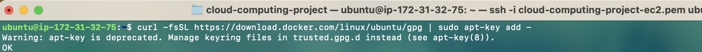
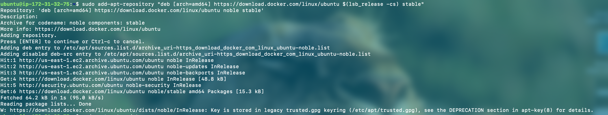
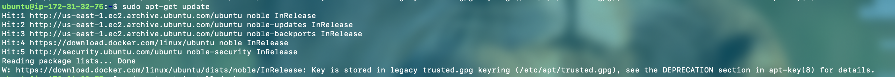

# Guía para Subir y Ejecutar un Proyecto Docker en EC2 (Ubuntu)
## Instalación de docker en la instancia de EC2 con Ubuntu

### 1. Agregar la clave GPG del repositorio de Docker:
Es necesario para que el sistema confíe en los paquetes de Docker.  
Ejecutar el comando:

```
curl -fsSL https://download.docker.com/linux/ubuntu/gpg | sudo apt-key add -
```



### 2. Agregar el repositorio de Docker:

Ejecutar el comando:

```
sudo add-apt-repository "deb [arch=amd64] https://download.docker.com/linux/ubuntu $(lsb_release -cs) stable"
```



### 3. Actualizar el índice de paquetes para incluir el repositorio recién añadido:
Es recomendable actualizar los paquetes disponibles:
Ejecutar el comando:

```
sudo apt-get update
```



### 4. Instalar Docker:
Ejecutar el comando:

```
sudo apt-get install docker-ce
```


### 5. Verificar la instalación de Docker
Ejecutar el comando:

```
docker --version
```


### 6. Iniciar Docker
Ejecutar el comando:

```
sudo systemctl start docker
```

### 7. Agregar el usuario a Docker
Es necesario para poder ejecutar docker sin sudo
Ejecutar el comando:

```
sudo usermod -aG docker ubuntu
```

## Subir los Archivos Docker a la Instancia EC2

Ejecutar el comando:

```
scp -i "key-pair.pem" -r /ruta/proyecto ubuntu@your-public-ip:/home/ubuntu/
```

##  Construir y Ejecutar las Imágenes Docker en EC2

### 1. Navegar al proyecto
Ejecutar el comando:

```
cd /home/ubuntu/proyecto
```

### 2. Construir las Imágenes Docker
Ejecutar el comando:

```
docker-compose build
```

### 3. Ejecutar los Contenedores
Ejecutar el comando:

```
docker-compose up -d
```

### 4. Verificar que los Contenedores Estén Corriendo Correctamente
Ejecutar el comando:

```
docker ps
```